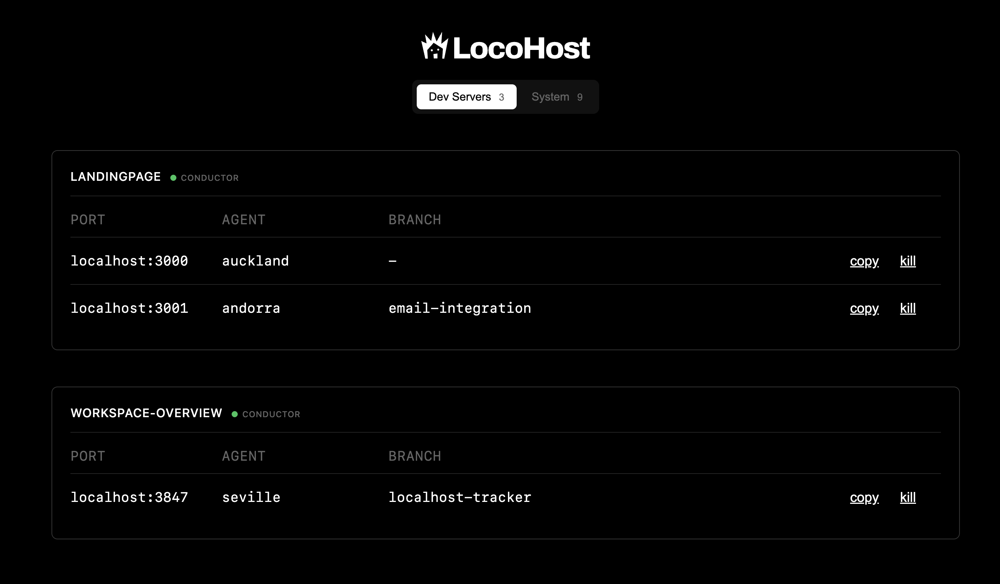

# Locohost

<p align="center">
  
</p>

A browser-based utility to track and manage localhost dev servers.

## The Problem

When you're running multiple coding agents in parallel with [Conductor](https://conductor.build), you quickly end up with a dozen localhost servers scattered across different ports. Which one is port 3000 again? Is that old server from yesterday still hogging 8080? I got tired of running `lsof` commands and hunting through terminal tabs, so I vibe-coded this little utility one afternoon.

It's a simple tool that shows all your localhost processes in one place, grouped by workspace. No guarantees, no warranties—just something that scratches my own itch. Maybe it'll help you too.

## Features

- **Track all localhost processes** - See everything running on localhost ports
- **Grouped by workspace** - Organized by Conductor workspace for easy navigation
- **Conductor integration** - Shows which workspaces are active in Conductor
- **Kill processes** - Stop servers directly from the browser
- **Copy kill commands** - Copy `kill -9 <pid>` to clipboard
- **Keyboard shortcuts** - Press `r` to refresh

## Quick Start

```bash
npm start
```

Then open http://localhost:3847

## Development

```bash
npm run dev  # runs with --watch for auto-reload
```

## Stack

- Pure Node.js (no dependencies)
- Single file server (~600 lines)
- Uses `lsof` to detect processes
- Reads Conductor SQLite DB for workspace info

## Screenshot



## License

MIT
